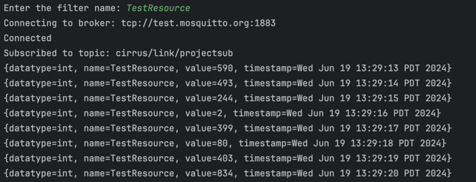

# Take Home Project: ESP8266 MQTT Publisher and Java Resource Event Generator/Handler 

## Project Overview & Writeup


This project showcases the design and implementation of an IoT-based system using an ESP8266 microcontroller and a Java application. The ESP8266 publishes random values to an MQTT broker every second, and a Java application generates events based on these values and then handles these events by encoding them and writing them to a file events.txt. The project includes the following components:

1. **ESP8266 MQTT Publisher**: Publishes random integer values between 1 and 1000 to an MQTT topic every second.


2. **Java Resource Event Generator**: An event generator that connects to a public MQTT broker, subscribes to a topic where random integers are published every second, and processes the received messages by generating resource events.
3. **Java Resource Event Handler**: Processes the received events, and supports encoding, filtering, and logging functionalities. Handled events are printed to console and logged in file events.txt.



## Repository Structure
- `Arduino/src/nodeMCU.ino`: Contains the Arduino sketch for the ESP8266 MQTT Publisher.
- `Java/src/main/java/org.example/`
  - `ErrorLoggingConfiguration.java`: Configuration class for error logging.
  - `EventHandlerInterface.java`: Interface for handling events that can be extended to implement more event handlers.
  - `ResourceEventGenerator.java`: Class responsible for generating resource events.
  - `ResourceEventHandler.java`: Class for handling resource events.

# Tasks and Considerations

## Task 1: Using Java, design and implement a single threaded Resource Event Generator that produces resource events with random values once a second
For Task 1, I decided to create a Resource Event Generator that generates resource events based on inputs it recieves from an ESP8266 Microcontroller that publishes random integers once per second to an MQTT broker. 

The ESP8266 connects to wifi and an open source MQTT broker:
```ino
const char* ssid = "MyWIFI";
const char* password = "password";
//using an open source MQTT broker offered my mosquitto.org
const char* mqtt_server = "test.mosquitto.org";

WiFiClient espClient;
PubSubClient client(espClient);
unsigned long lastMsg = 0;
#define MSG_BUFFER_SIZE (50)
char msg[MSG_BUFFER_SIZE];
int value = 0;

void setup_wifi() {
  delay(10);
  // connect to a WiFi network
  Serial.println();
  Serial.print("Connecting to ");
  Serial.println(ssid);

  WiFi.mode(WIFI_STA);
  WiFi.begin(ssid, password);

  while (WiFi.status() != WL_CONNECTED) {
    delay(500);
    Serial.print(".");
  }
```

```ino
void setup() {
//baud rate
  Serial.begin(115200);
  setup_wifi();
  client.setServer(mqtt_server, 1883);
  client.setCallback(callback);
}
```


This bit of code runs on the ESP8266 and is producing the random int every second to the MQTT broker:
```ino
 unsigned long now = millis();
  if (now - lastMsg > 1000) {
    lastMsg = now;
    value = random(1, 1001); 
    snprintf(msg, MSG_BUFFER_SIZE, "%ld", value);
    Serial.print("Publish message: ");
    Serial.println(msg);
    client.publish("cirrus/link/projectsub", msg);
  }
}
```

The Event Generator subcribes to the MQTT topic and generates events based on the integer values it receives:

```Java
public class ResourceEventGenerator {
  private static final Logger errorLOGGER = Logger.getLogger(ResourceEventGenerator.class.getName());
  private final List<ResourceEventHandler> handlers = new ArrayList<>();
  private MqttClient client;

  public void registerHandler(ResourceEventHandler handler) {
    handlers.add(handler);
  }

  public void start() {
    // info to connect to mosquitto MQTT broker where the random int is published every one second
    String broker = "tcp://test.mosquitto.org:1883";
    String clientId = "JavaSample";
    String topic = "cirrus/link/projectsub";

    try {
      client = new MqttClient(broker, clientId);
      MqttConnectOptions connOpts = new MqttConnectOptions();
      connOpts.setCleanSession(true);

      client.setCallback(new MqttCallback() {
        @Override
        public void connectionLost(Throwable cause) {
          errorLOGGER.log(Level.WARNING, "Connection lost", cause);
        }

        @Override
        public void messageArrived(String topic, MqttMessage message) throws Exception {
          String payload = new String(message.getPayload());
          try {
            int value = Integer.parseInt(payload);
            Map<String, Object> resource = new HashMap<>();
            resource.put("name", "TestResource");
            resource.put("timestamp", new Date());
            resource.put("datatype", "int");
            resource.put("value", value);
            resourceEventGenerated(resource);
          } catch (NumberFormatException e) {
            errorLOGGER.log(Level.WARNING, "Invalid integer received: {0}", payload);
          }
        }

        @Override
        public void deliveryComplete(IMqttDeliveryToken token) {
          // Not used here
        }
      });

      System.out.println("Connecting to broker: " + broker);
      client.connect(connOpts);
      System.out.println("Connected");
      client.subscribe(topic);
      System.out.println("Subscribed to topic: " + topic);

    } catch (MqttException me) {
      System.out.println("reason " + me.getReasonCode());
      System.out.println("msg " + me.getMessage());
      System.out.println("loc " + me.getLocalizedMessage());
      System.out.println("cause " + me.getCause());
      System.out.println("excep " + me);
      errorLOGGER.log(Level.SEVERE, "MQTT Exception occurred", me);
    }
  }

  private void resourceEventGenerated(Map<String, Object> resource) {
    handlers.forEach(handler -> handler.handleEvent(resource));
  }

  public static void main(String[] args) {
    ErrorLoggingConfiguration.configure();
    ResourceEventGenerator generator = new ResourceEventGenerator();
    ResourceEventHandler handler = new ResourceEventHandler();
    generator.registerHandler(handler);
    generator.start();
  }
}

```

The resource events are set to be created hashmaps a string as the key and an object as the value, with the following parameters:
- "name" = A string with the value "TestResource",
- "timestamp" = a current timestamp using the Date() function,
- "datatype" = A string with the value "int",
- "value" = a random integer that is parsed from the payload recived from the MQTT broker.

The messageArrived method overrides the default method to handle incoming MQTT messages. When a message arrives, the payload is processed and a resource event is generated. 
```Java
    @Override
public void messageArrived(String topic, MqttMessage message) throws Exception {
  String payload = new String(message.getPayload());
  try {
    int value = Integer.parseInt(payload);
    Map<String, Object> resource = new HashMap<>();
    resource.put("name", "TestResource");
    resource.put("timestamp", new Date());
    resource.put("datatype", "int");
    resource.put("value", value);
    resourceEventGenerated(resource);
  } catch (NumberFormatException e) {
    errorLOGGER.log(Level.WARNING, "Invalid integer received: {0}", payload);
  }
}
```

## Task 2. Using Java, design and implement a Resource Event Handler that will register with the Resource Event Generator and support the following functions on handling events:
### 1. Encoding the resource events in some format (JSON, plain text, array of bytes, etc).

This encode Event method takes the HashMap and converts it into a simple string that can be logged to the console or to a text file.
This method could be easily altered to encode to JSON or another desired format.
```Java
    private String encodeEvent(Map<String, Object> resource) {
  return resource.toString(); 
}
```

### - Filtering the resource events by “name”, “datatype”, or “value”.
When the program first starts the user is prompted for a filter name from which the results will be filtered. 
The ResourceEventHandler takes the filterName string as an input and filters results based on it.
```Java
public static void main(String[] args) {
  ErrorLoggingConfiguration.configure();
  Scanner scanner = new Scanner(System.in);

  System.out.print("Enter the filter name: ");
  String filterName = scanner.nextLine();

  ResourceEventGenerator generator = new ResourceEventGenerator();
  ResourceEventHandler handler = new ResourceEventHandler(filterName);
  generator.registerHandler(handler);
  generator.start();

  scanner.close();
}

```
The filterName Method is a boolean that returns true if the value paired with the key "name" is equal to the name supplied by the user in the console.
```Java
    private boolean filterName(Map<String, Object> resource) {
  // Filter by the supplied name
  return filterName.equals(resource.get("name"));
}

```
This method could easily be extended to any other parameter of the resource event.

### - Logging the resource events to console or file.

The ResourceEventHandler logs events to both the console using System.out.println,

and to a file events.txt using a BufferedWriter

```Java
private void logEvent(String encodedResource) {
  System.out.println(encodedResource); //
  try (BufferedWriter writer = new BufferedWriter(new FileWriter(LOG_FILE_PATH, true))) {
    writer.write(encodedResource + "\n");
  } catch (IOException e) {
    errorLOGGER.log(Level.SEVERE, "Failed to write to log file: " + LOG_FILE_PATH, e);
  }
}
```

## Task 3: Consider how the Resource Event Handler could be extended support additional features:
### - Buffering and re-ordering events based on timestamp

Events could be buffered using a Java PriorityQueue that compares the timestamps of the objects being added to it and orders them 
```Java
PriorityQueue<>(Comparator.comparingLong(event -> ((Date) event.get("timestamp")).getTime()));
```

Objects could then be processed in order. This approach is particularly beneficial in real-time systems where event timing is crucial, as it maintains the integrity of the event sequence.
### - Extended to allow custom event handling logic
The EventHandlerInterface can be implemented to allow custom event handling logic in any way that the user requires. One just needs to implement the EventHandler inerface along with the required handleEvent method and any other logic the user requires.
```Java
public interface EventHandlerInterface {
  void handleEvent(Map<String, Object> resource);
}

```

## Task 4: Consider how the handler’s performance could be improved to handle very high loads of events instead of just once a second.

### Thread Pool with Priority Queue: 

One strategy for handling high loads of events instead of just once per second is using a thread pool, instead of just a single thread like in the implementation in this project.

The thread pool would work by creating a pool of worker threads that can process events concurrently.

In a standard thread pool, tasks are executed by available threads without any inherent ordering guarantees. Therefore, if tasks are submitted to a thread pool, they will not necessarily be processed in the order they were submitted. This means that maintaining the order of events by timestamp requires additional handling.

A thread pool with a priority queue would allow the user to accurately process high loads of events.

By combining these mechanisms, we can ensure that events are processed in order of their timestamps while leveraging the efficiency and concurrency benefits of a thread pool.


